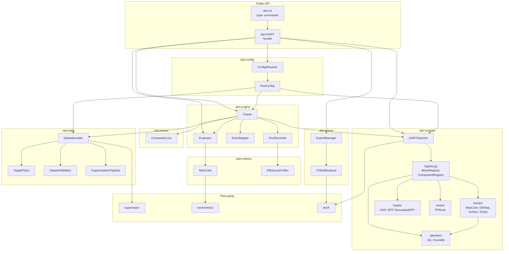
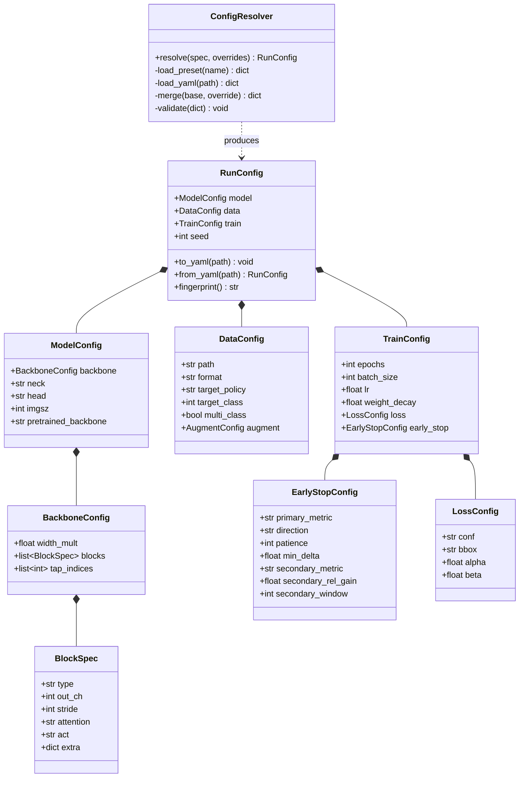
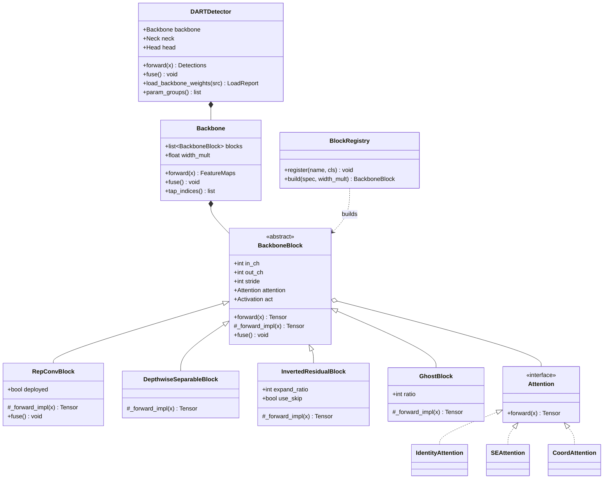
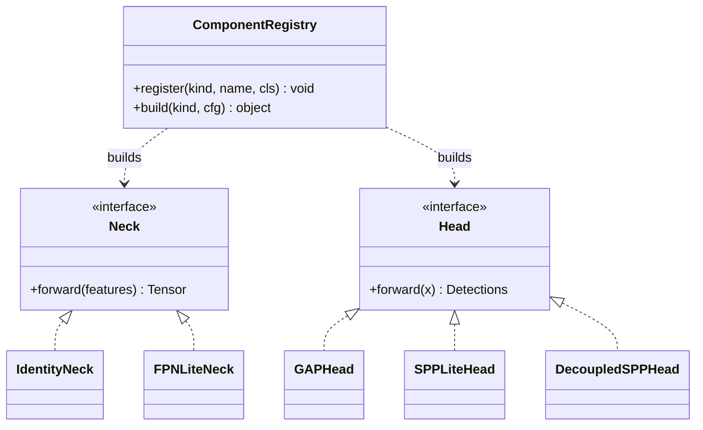
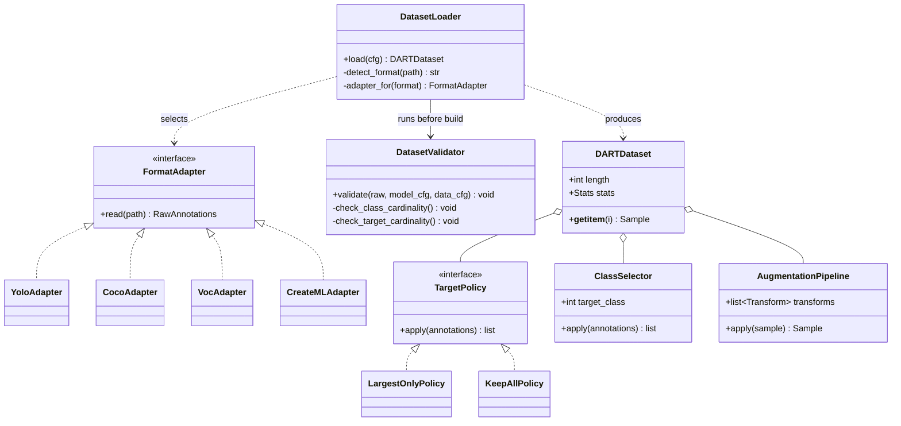
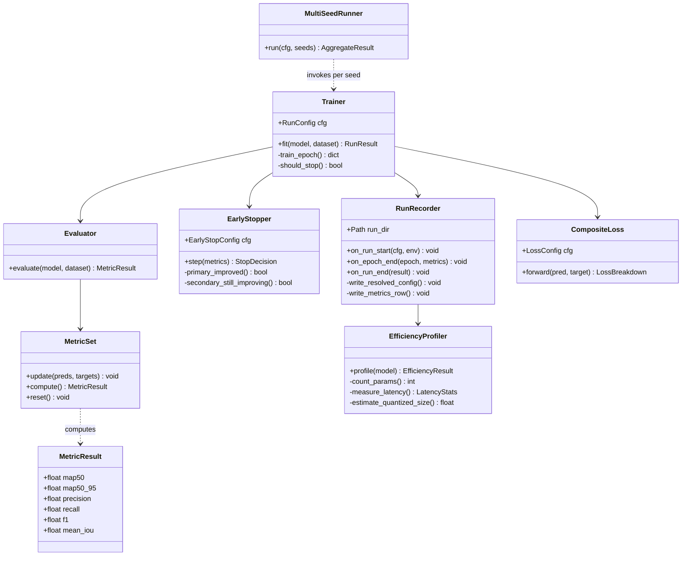
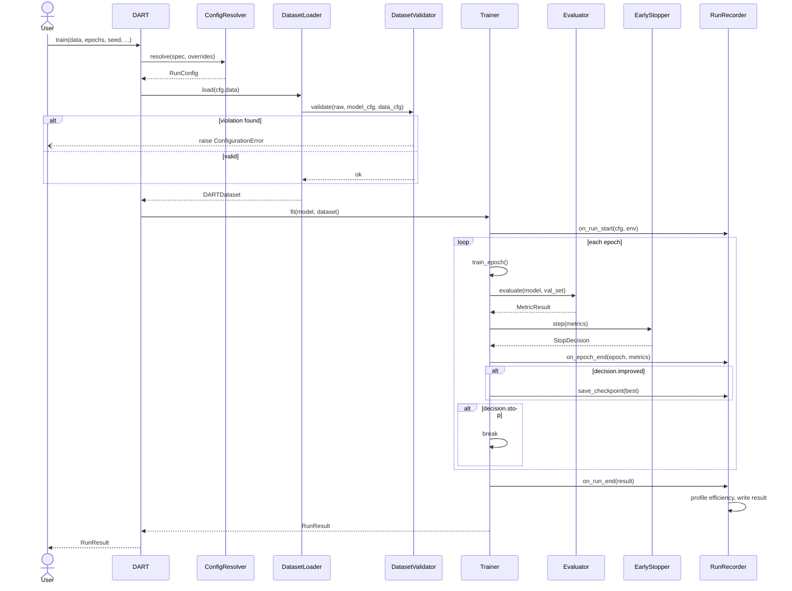
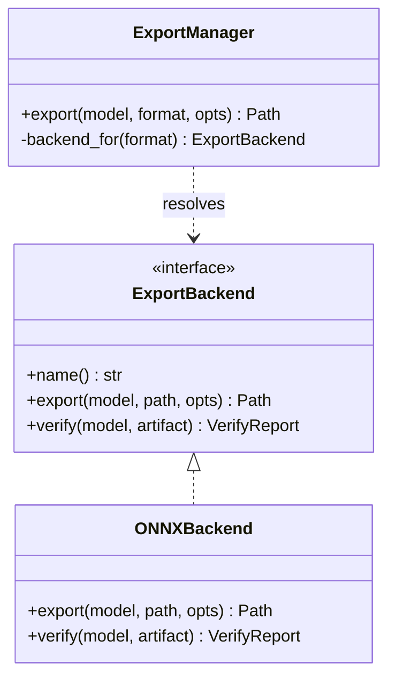
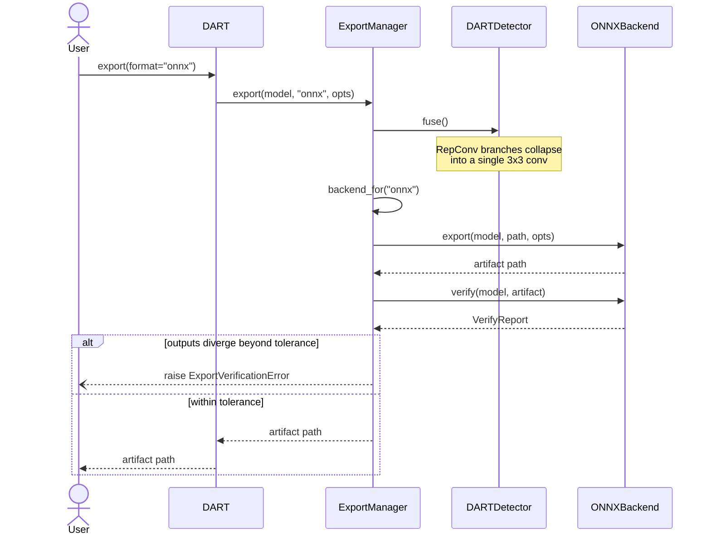

# DART Framework — UML Design

**Status:** Draft for approval
**Stage:** 2 of 3 (Requirements → **UML** → Implementation)
**Depends on:** `01-requirements-specification.md` (approved)

---

## 1. Purpose and Reading Guide

This document translates the approved requirements into a concrete design.
Every class and interaction here traces back to a requirement ID; Section 9
provides the reverse mapping so an approver can verify nothing was invented
and nothing was dropped.

Diagrams, in order:

| § | Diagram | Answers |
|---|---|---|
| 3 | Package structure | What are the top-level modules and how do they depend on each other? |
| 4 | Config system | How does `"dart-xd"` become a fully-resolved, snapshottable configuration? |
| 5 | Model composition | How do backbone, neck, head, attention, and loss compose into the seven variants? |
| 6 | Data layer | How does a folder of any supported format become validated training batches? |
| 7 | Engine and metrics | How does a training run execute, stop, and record itself? |
| 8 | Export | How does a trained model become an ONNX artifact? |

---

## 2. Design Principles

Three principles govern the structure below. Each exists to satisfy a
non-functional requirement, not as abstract preference.

1. **Configuration over code for variants** (NFR-8, FR-2.2). The seven DART
   variants differ along orthogonal axes (block sequence, attention, head,
   neck, activation, loss). Modeling them as seven subclasses would make an
   eighth variant a new class. Instead, every axis is an interface resolved
   through a registry, and a variant is a YAML file listing which
   implementations to assemble. The test this principle must pass: *changing
   any architectural choice, including the backbone block sequence, must
   require editing configuration only, never source.*

2. **Explicit failure over silent adaptation** (FR-1.3, FR-1.4, FR-1.7). The
   data layer validates the dataset against the model configuration and
   raises rather than guessing. No component silently drops annotations,
   remaps classes, or picks a policy.

3. **Delegate the commodity, own the contribution** (NFR-5). Dataset parsing
   goes to `supervision`; metric computation goes to `torchmetrics`. The
   framework owns the architecture, the training engine, the config system,
   and the glue.

---

## 3. Package Structure



**Dependency rule:** arrows point from dependent to dependency, and there
are no cycles. `dart.models` knows nothing about `dart.data` or
`dart.engine` — a model can be constructed, run, and exported without any
training machinery present. This is what makes FR-4.2 (benchmark-only
evaluation) and FR-5.1 (export) cheap.

---

## 4. Configuration System

Satisfies FR-2.1, FR-2.2, FR-3.4, FR-6.3.



**Key decisions.**

`ConfigResolver` is the *only* place defaults are applied. A preset name
(`"dart-xd"`) and a YAML path are both just inputs to `resolve()`; the output
is always a fully-populated `RunConfig` with no unset fields. This is what
makes FR-3.4 mechanically true rather than aspirational: `RunConfig.to_yaml()`
writes the resolved object, so the snapshot cannot drift from what actually
ran.

`EarlyStopConfig` carries the secondary-metric fields as optional. When
`secondary_metric` is `None`, the stopper degenerates to standard
patience-based stopping — satisfying FR-3.2's requirement that the compound
criterion be optional rather than mandatory.

The seven paper variants ship as preset YAML files, not as code. Adding an
eighth is a file, not a class.

---

## 5. Model Composition

Satisfies FR-2.1, FR-2.2, FR-2.4, FR-2.5, FR-2.6, FR-5.3, NFR-8.

The governing constraint here is that **testing a different architecture must
not require touching code**. A backbone is therefore not four hardcoded
blocks; it is a list of block specifications resolved through a registry.
Swapping Ghost for depthwise-separable in position 4, or attaching
Coordinate Attention to the RepConv stem, is a YAML edit.



**Attention is a property of every block, not of one block type.**
`BackboneBlock` holds an `Attention` slot and applies it via a template
method: the public `forward()` calls the subclass's `_forward_impl()` and
then the attention module. Subclasses implement only their own convolution
logic and never mention attention. Consequences:

- Any block type can carry SE, Coordinate Attention, or a future mechanism.
- "No attention" is `IdentityAttention`, a null-object, so there is no
  branch in `forward()` and no `Optional` to guard — the same pattern used
  for `IdentityNeck`.
- Adding a third attention mechanism means implementing `Attention` and
  registering it. No existing block changes.

**`DepthwiseSeparableBlock` is now first-class.** In the research codebase
depthwise separable convolution exists only *inside* the inverted residual
block. Promoting it to its own block type makes the cheaper, non-expanding
alternative available in any position, which matters for exploring
configurations below the paper's parameter budget.

### 5.1 Head, Neck, and Loss

The same registry pattern applies to the other three axes; each is an
interface with a null-object default where "absent" is meaningful.



### 5.2 How a Variant Is Declared

A variant is a YAML file, not a class. The paper's DART-XD:

```yaml
backbone:
  width_mult: 1.0
  blocks:
    - {type: repconv,      out_ch: 16, stride: 2, attention: none,  act: silu}
    - {type: inverted_res, out_ch: 32, stride: 2, attention: coord, act: silu, expand_ratio: 4}
    - {type: inverted_res, out_ch: 48, stride: 2, attention: coord, act: silu, expand_ratio: 4}
    - {type: ghost,        out_ch: 64, stride: 2, attention: none,  act: silu}
neck: fpn_lite
head: decoupled_spp
loss: {conf: focal, bbox: ciou}
```

The seven paper variants ship as seven such files. Reproducing the paper is
loading a preset; exploring beyond it is editing a copy. The block list is
what makes FR-2.2 ("define variants outside the validated seven") hold at
the backbone level and not merely at the head/neck level.

The seven presets differ only in the fields below; the block *sequence*
(repconv → inverted_res → inverted_res → ghost) is identical across all of
them, which is precisely the paper's claim of a shared backbone:

| Preset | `attention` (blocks 2–3) | `act` | `neck` | `head` | `loss` |
|---|---|---|---|---|---|
| dart-b | se | relu6 | identity | gap | bce + smooth_l1 |
| dart-b-ciou | se | relu6 | identity | gap | focal + ciou |
| dart-s | se | relu6 | identity | spp | focal + ciou |
| dart-d | se | relu6 | identity | decoupled_spp | focal + ciou |
| dart-f | se | relu6 | fpn_lite | gap | focal + ciou |
| dart-x | coord | silu | fpn_lite | spp | focal + ciou |
| dart-xd | coord | silu | fpn_lite | decoupled_spp | focal + ciou |

`dart-b` and `dart-b-ciou` are byte-identical apart from the loss line,
making the paper's loss-only ablation self-evident from the configs
themselves.

**`width_mult` (FR-2.5) applies at build time.** `BlockRegistry.build()`
scales each spec's `out_ch` by the multiplier, so one config expresses the
whole width family rather than requiring a file per width.

**Tap points for the neck.** `FPNLiteNeck` needs an early and a late feature
map. Rather than hardcoding "block 2 and block 4", `Backbone.tap_indices()`
exposes which block outputs are retained, configured alongside the block
list. A backbone with six blocks can feed a neck from positions 3 and 6
without any change to `FPNLiteNeck`.

**Fusion (FR-5.3).** `fuse()` is defined on `BackboneBlock` as a no-op and
overridden only by `RepConvBlock`. `Backbone.fuse()` iterates all blocks
unconditionally, so a future second fusible block type requires no change to
the traversal. `ExportManager` invokes this automatically (Section 8).

**Pretrained weights (FR-2.6).** `Backbone` is constructible independently of
neck and head, and `load_backbone_weights()` returns a `LoadReport` naming
which layers loaded, which were skipped on shape mismatch, and which were
missing. `param_groups()` returns backbone and head parameters separately so
the trainer can assign different learning rates.

## 6. Data Layer

Satisfies FR-1.1 through FR-1.7.



**Validation ordering matters.** `DatasetValidator` runs on the *raw*
annotations, before any policy or selector is applied. If it ran afterwards,
a `LargestOnlyPolicy` would have already discarded the extra annotations and
the multi-target violation would be invisible — the system would silently
adapt, which FR-1.7 forbids.

The two checks:

- **Class cardinality:** dataset has more than one annotated class, model is
  single-class, and `data.target_class` is unset → error naming the classes
  found and the config key that resolves it.
- **Target cardinality:** any image has more than one annotation, model is
  single-target, and `data.target_policy` is unset → error naming the first
  offending image path and the config key.

`ClassSelector` is instantiated only when `target_class` is explicitly set,
enforcing FR-1.4's "never automatic" requirement structurally: there is no
code path that constructs one from inference.

---

## 7. Training Engine and Metrics

Satisfies FR-3.1 through FR-3.6, FR-4.1 through FR-4.5, FR-7.1, FR-7.2.



**`EarlyStopper` is a pure decision function.** It receives a metrics dict and
returns a `StopDecision` (`stop`, `improved`, `reason`). It holds no
reference to the model, the trainer, or the filesystem. This makes FR-3.2's
configurability testable in isolation: the compound criterion can be verified
against a synthetic metric sequence without training anything, which is
exactly what the CI Tier 1 test needs.

**`RunRecorder` owns all persistence.** The trainer never writes files
directly. `on_run_start` writes the resolved config (FR-3.4) and the
environment record (FR-7.1); `on_epoch_end` appends a metrics row;
`on_run_end` writes the final result and triggers the efficiency profile.
Producing the paper's `model_comparison.csv` schema (FR-4.4) is then a
concatenation of per-run outputs, not a separate reporting pipeline.

**`EfficiencyProfiler` runs on the fused model.** Parameter count and latency
measured on an unfused RepConv model would overstate both — the profiler
therefore operates post-`fuse()`, matching what actually deploys (FR-4.5).

### 7.1 Training Sequence



Note the validation gate sits *before* `Trainer.fit()` is ever entered. A
misconfigured dataset fails in seconds, not after an epoch of wasted compute.

---

## 8. Export

Satisfies FR-5.1, FR-5.2, FR-5.3.





`verify()` is part of the backend interface, not an optional extra: an export
that silently produces a numerically different model is worse than a failed
export. This is also the check CI Tier 2 runs on every pull request.

Registering a future backend (TFLite, NCNN) means implementing
`ExportBackend` and registering it — no change to `ExportManager`'s public
signature, to `DART.export()`, or to any model code. That is FR-5.2 realized
structurally.

---

## 9. Requirements Traceability

| Requirement | Design element |
|---|---|
| FR-1.1, FR-1.2 | `DatasetLoader`, `FormatAdapter` + four implementations |
| FR-1.3 | `TargetPolicy` interface, `LargestOnlyPolicy`, `KeepAllPolicy` |
| FR-1.4 | `ClassSelector`, constructed only from explicit config |
| FR-1.5 | `DARTDataset.stats` |
| FR-1.6 | `AugmentationPipeline` |
| FR-1.7 | `DatasetValidator`, invoked pre-build in the training sequence |
| FR-2.1, FR-2.2 | `ConfigResolver.load_preset` / `load_yaml` → `RunConfig`; `BlockRegistry` / `ComponentRegistry` resolve every architectural axis by name |
| FR-2.3 | `DART` facade checkpoint resolution (local → Hub) |
| FR-2.4, FR-2.5 | `ModelConfig.imgsz`, `BackboneConfig.width_mult` applied at `BlockRegistry.build()` |
| FR-2.6 | `Backbone` standalone construction, `load_backbone_weights()`, `param_groups()` |
| FR-3.1 | `Trainer.fit()` |
| FR-3.2 | `EarlyStopper` + `EarlyStopConfig` |
| FR-3.3 | `RunRecorder` checkpoint state |
| FR-3.4 | `RunConfig.to_yaml()` via `RunRecorder.on_run_start` |
| FR-3.5 | `RunConfig.seed` |
| FR-3.6 | `CompositeLoss` + `LossConfig` |
| FR-4.1 | `MetricSet` → `MetricResult` (incl. `map50_95`) |
| FR-4.2 | `Evaluator` usable without `Trainer` |
| FR-4.3 | `MultiSeedRunner` |
| FR-4.4 | `RunRecorder` metrics schema |
| FR-4.5 | `EfficiencyProfiler` |
| FR-5.1 | `ONNXBackend` |
| FR-5.2 | `ExportBackend` interface + `ExportManager.backend_for` |
| FR-5.3 | `fuse()` chain, invoked by `ExportManager` |
| FR-6.1 | `DART` facade |
| FR-6.2 | `dart.cli` |
| FR-6.3 | `RunConfig.from_yaml` / `to_yaml` |
| FR-7.1 | `RunRecorder` environment record |
| FR-7.2 | `RunConfig.fingerprint()` recorded per run |
| NFR-8 | Registry-resolved assembly; `BackboneConfig.blocks` makes the block sequence itself configuration; `Attention` attachable to any `BackboneBlock` |

---

## 10. Open Design Questions

1. **`Detections` return type.** The model's forward output needs a stable
   shape that works for single-target today and multi-target later (NFR-8).
   Proposal: always return a batched tensor with an explicit count dimension,
   so single-target is `N=1` rather than a special case. Needs confirmation
   before the head interfaces are frozen.

2. **`MetricSet` and mean IoU.** `torchmetrics` provides mAP directly, but
   "mean IoU over positive samples" as the paper defines it is not a stock
   detection metric. It should be composed from `torchmetrics` primitives
   rather than hand-rolled — the exact composition needs settling during
   implementation.

3. **Resume granularity (FR-3.3).** Resuming from epoch boundaries is simple
   and probably sufficient; mid-epoch resume requires checkpointing the
   dataloader state. Recommend epoch-boundary only unless there is a concrete
   need.

---

## 11. Approval

This document gates Stage 3 (Implementation). Once the structure in
Sections 3–8 and the open questions in Section 10 are resolved, implementation
begins, starting from the dependency leaves (`dart.models`, `dart.config`)
inward to the facade.
